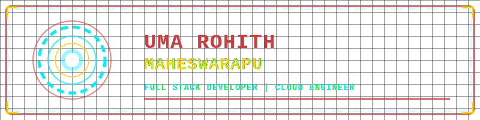

<!-- Custom Inline SVG Iron Man / Stark Tech Banner -->

  

<!-- Animated side banners (glowing India flags) -->

<h1 align="center">Hi 👋, I'm Uma Rohith Maheswarapu</h1>
<h3 align="center">A passionate Programmer and Cloud Enthusiast</h3>

I am fascinated by how computer technology 🌐 has brought changes to our lives that could never have been predicted; witnessing the expansion of computer science allowed me to consider studying software engineering from an early age, and my enthusiasm has perpetually developed since this time. And also I love exploring new tech stack 💻 and leveraging them to build cool stuffs 🛠️

 
  

  
  
  
  
  
  

 

  
  
  
  
  
  

<!-- Iron Man suit-up sidebar animation -->

  

- 🔭 I’m currently open to a new Job

- 🌱 I’m currently learning **DevOps**

- 👨‍💻 All of my projects are available on my GitHub: [github.com/umarohith](https://github.com/umarohith)

- 💬 Ask me about **Java, Python, NodeJS and Cloud Computing**

- 📫 How to reach me: connect with me through LinkedIn / GitHub

- 📄 Know about my experiences: check my resume / LinkedIn profile

- ⚡ Fun fact: **I enjoy solving complex algorithmic problems and building real-world projects**

 
<h3 align="center">Connect with me:</h3>

  
  

 

<h3 align="center">Languages and Tools:</h3>

<b>Backend</b>

  

 

<b>Frontend</b>

  

 

<b>Database</b>

  

 

<b>Cloud Servers</b>

  

 

<b>Tools</b>

  

 

<h3 align="left">GitHub Stats:</h3>

  
  

  

<h3 align="left">Activity:</h3>

  

  

<h3 align="left">Contribution Snake:</h3>

  

  

Created with 🧡 by <a href="https://github.com/umarohith">Uma Rohith Maheswarapu</a>
